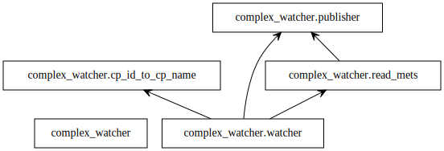
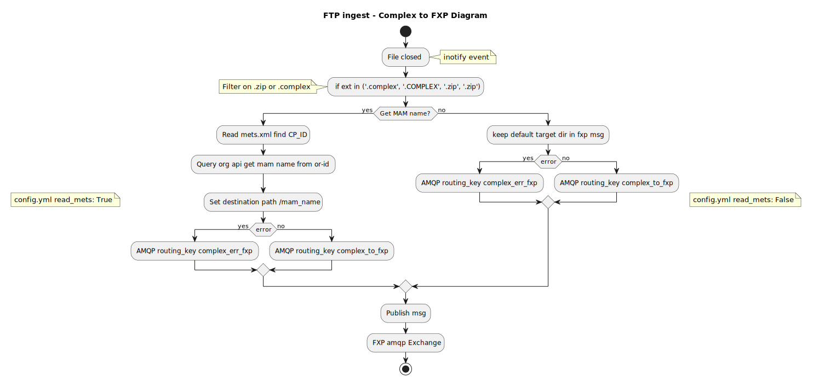

# complex_watcher_to_fxp

## Packages

## App flow



## install
- python setup.py install

## config 
- create a config.yml file 

- config.yml example:
```
viaa:
  logging:
    level: DEBUG
app:
      watcher:
        dest_path: /incoming/dest/
        dest_host: dest_host_ftp 
        dest_user: auser 
        dest_pass: apass         
        source_host: source_host_ftp
        source_path: /incoming/complex/
        source_user: ftpuser
        source_pass: pass 
        org_api_url: http://org-api-qas-meemoo/
        read_mets: True
      amqpPublisher:
        host: mq-host
        user: auser 
        pass: ww         
        queue: test
```
## Options:
- read_mets : True or False , find the mam name from CP_id in xml

## run
execute `complex_watcher`
